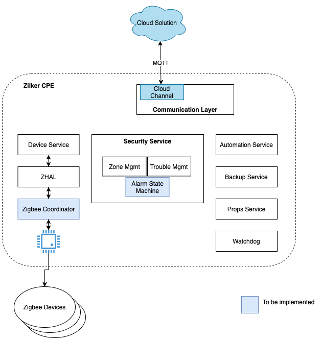

# Overview

This project is an SDK that can compile and run, however requires cloud connectivity 
and actual device integrations (Zigbee, BLE, Z-Wave, etc).  

To create a working solution, the SDK consumer would:

- Implement a 'channel' (in `commService`) to connect to their cloud and translate our internal 
device data model and service control.
- Implement some device subsystems to `deviceService` and corresponding device drivers.  This SDK 
includes device drivers which sit upon ZHAL (Zigbee Hardware Abstraction Layer)
to aid in the that effort.

## Directory structure:

- `3rdParty`   : 3rd-party dependencies
- `branding`   : default and customer-specific configuration/settings
- `buildTools` : build configurations for cmake
- `source`     : core source-code tree
- `tools`      : helpers & generators local to this tree

Refer to `README` files within the respective areas
for additional building details.

# Architecture

Eash *Service* provides a layer of functionality that can be accessed via an api (generated code).
Most services consume and produce events (generated code) that any process can listen for.

- [automation](source/services/automation/README.md)
     : Leverage *littlesheens* https://github.com/Comcast/littlesheens.git 
       to invoke actions based upon events.  
       
- [backupRestore](source/services/backupRestore/README.md)
     : Periodically create a tarball of local configuration data so it can
       be stored externally (ideally the cloud).  In the event of a restore, 
       this will expand the tarball and inform each service of the location 
       of the old configuration for importing.
       
- [comm](source/services/comm/README.md) 
     : Communication layer to the cloud.  Supports the concept of multiple *channels*
       to allow one or more cloud couplings.  
       
- [device](source/services/device/README.md)
     : Interaction with various devices (Zigbee, BLE, Wifi, etc).
     
- [props](source/services/props/README.md)
     : Store and maintain Key/Value pairs for runtime options or basic configuration.
     
- `rdkIntegration`
     : Listen for events from the RDK dbus

- [watchdog](source/services/watchdog/README.md)
     : Launch processes, restart them on failure
     
- [ipcGenerator](tools/ipcGenerator/README.txt)
     : Not a service, but a utility to generate the API layers of services (IPC and Events).
     
- [ZITH](tools/zith/README.md)
     : Not a service, but a utility that provides a mocked zigbee controller.

# Additional Resources

* Refer to the [BUILDING.md](BUILDING.md) file for details on setting up the environment and building the source code
* See [GUIDE.md](GUIDE.md) for a step-by-step guide to using and testing this SDK
