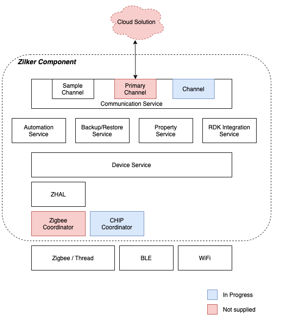

# Overview

This project is an SDK that can compile and run, however requires cloud connectivity 
and actual device integrations (Zigbee, BLE, Z-Wave, etc).  **TODO** add more here

To create a working solution, the SDK consumer would:

- Implement a 'channel' (in `commService`) to connect to their cloud and translate our internal 
device data model and service control.
- Implement some device subsystems to `deviceService` and corresponding device drivers.  This SDK 
includes device drivers which sit upon ZHAL (Zigbee Hardware Abstraction Layer)
to aid in the that effort.

## Directory structure:

- `3rdParty`   : 3rd-party dependencies
- `branding`   : default and customer-specific configuration/settings
- `buildTools` : build configurations for cmake
- `source`     : core source-code tree
- `tools`      : helpers & generators local to this tree

Refer to `README` files within the respective areas
for additional building details.

# Architecture

Eash *Service* provides a layer of functionality that can be accessed via an api (generated code).
Most services consume and produce events (generated code) that any process can listen for.

- [automation](source/services/automation/README.md)
     : Leverage *littlesheens* https://github.com/Comcast/littlesheens.git 
       to invoke actions based upon events.  
       
- [backupRestore](source/services/backupRestore/README.md)
     : Periodically create a tarball of local configuration data so it can
       be stored externally (ideally the cloud).  In the event of a restore, 
       this will expand the tarball and inform each service of the location 
       of the old configuration for importing.
       
- [comm](source/services/comm/README.md) 
     : Communication layer to the cloud.  Supports the concept of multiple *channels*
       to allow one or more cloud couplings.  
       
- [device](source/services/device/README.md)
     : Interaction with various devices (Zigbee, BLE, Wifi, etc).
     
- [props](source/services/props/README.md)
     : Store and maintain Key/Value pairs for runtime options or basic configuration.
     
- `rdkIntegration`
     : Listen for events from the RDK dbus

- [security](source/services/security/README.md)
     : Zone, Trouble, and "a stubbed" Alarm State Machine.
     
- [watchdog](source/services/watchdog/README.md)
     : Launch processes, restart them on failure
     
- [ipcGenerator](tools/ipcGenerator/README.txt)
     : Not a service, but a utility to generate the API layers of services (IPC and Events).
     
- [ZITH](tools/zith/README.md)
     : Not a service, but a utility that provides a mocked zigbee controller.

# Building

## Quick Steps
If you're like most developers and don't feel like reading instructions, you can
attempt these steps as a quick-n-dirty "just build it" approach for a workstation target.  
When this fails, please consider reading the rest of this file before asking stupid questions to others:

~~~~
# setup env
cd <wherever-the-code-is>
export ZILKER_SDK_TOP=`pwd`

# build and let script show steps necessary
./buildTools/linux/recipe.sh -m
~~~~

## Setup Build Environment

### Ubuntu (tested on 14.04, 16.04, 18.04, 20.04)
  - cmake, autoconf, texinfo
  - git 
  - m4, libtool, libtool-bin, curl
  - lib32z1, gcc-multilib 
  - **jdk 8, gradle 4.8.1** (for tools, ZITH)
    - _Newer versions of Java/Gradle may work, but these are tested versions_

~~~~
# enable building base code
sudo apt-get install git cmake autoconf texinfo openjdk-8-jdk openjdk-8-jre m4 libtool libtool-bin curl pkg-config lib32z1 gcc-multilib 
~~~~

### macOS:
  - **NOTE: not fully supported at this time**
  - cmake (3.10 or higher), autoconf, automake, texinfo, wget,
    gnu-tar, gpg, libtool (used as glibtool for some 3rdParty items)
  - Xcode (for git, gcc, make, libtool)
  - homebrew (to install missing packages)
  - docker (_optional_: can be used for building as linux)
  - **jdk 8, gradle 4.8.1** (for tools, ZITH)
    - _Newer versions of Java/Gradle may work, but these are tested versions_

~~~~
# enable building base code
brew install pkgconfig cmake wget automake autoconf texinfo libtool coreutils gpg gnu-tar 
~~~~

### Variables
Define the location of the source tree as the environment variable `ZILKER_SDK_TOP`.
The easy thing to do is add it to the `$HOME/.bashrc` or `$HOME/.bash_profile`.

## 3rd-Party Dependencies

Many of the platforms we build for will not supply needed 3rd-Party dependencies.
Therefore we must build them using the appropriate toolchain.  If missing, the 
3rd-Party dependencies will be built as part of the `recipe.sh` script execution.
See usage of that script to explicitly build these dependencies.

## Code Generation Dependency

Early in the cmake configuration step, a call is made to generate some code.
This depends on the "`ipcGenerator`" utility, which will be automatically built.
If for some reason the code generation utility needs a rebuild, it can be built 
manually via:

~~~
# build ipcGenerator
cd $ZILKER_SDK_TOP
gradle :ipcGenerator:build
~~~

## Build Zilker-SDK Codebase

Running the `recipe.sh` will leverage the cmake files to generate `Makefiles` and apply a branding.
For starters, get the usage by running the script with zero arguments.  
That should look something like:

~~~~
# ensure the $ZILKER_SDK_TOP environment variable is set
cd $ZILKER_SDK_TOP
./buildTools/linux/recipe.sh
linux_recipe:
  options:
  -h         : show this help
  -t         : build 3rd-party
  -m         : build mirror
  -D         : build DEBUG
  -R         : build RELEASE
  -v         : verbose build
  -z         : build with zith tests
~~~~
  
To run the built development code, you'll need to source in the environment (if not done before)
because the development scripts utilize those variables for the path locations:

~~~~
# source environment
. $ZILKER_SDK_TOP/buildTools/setup_env.sh linux

# should now be in "mirror" directory
cd $ZILKER_SDK_TOP/build/linux/mirror
./bin/xhStartup.sh
~~~~

## Building Tests

Tests are broken into two categories:
1. Unit Tests
2. Manual Tests

### Unit Tests
The *Unit Tests* are items that can be build, executed, and validated at build-time. 
Due to the "cross-compiling" nature of our environment, these should only be ran when the target
matches the machine (i.e. linux).  These are built/ran during the `recipe.sh` execution.

### Manual Tests
The *Manual Tests* are interactive in nature and really meant for development use.
All of these are assumed to be for the native environment and cannot be executed stand-alone.
Examples include communicating with a known camera or zigbee device (with dependencies on a ZigBee Radio)
These can be built/ran via:
~~~~
# after building main dependencies via recipe.sh
cd $ZILKER_SDK_TOP/build/linux
make all install manualTest
~~~~

## CLion IDE Support

**Before building/running from CLion**, you have to make an adjustment to the cmake settings.
Go to: **Settings->Build,Execution,Deployment->Cmake** and set the _"Cmake options"_ field to:
`-C <zilker-sdk-top-dir>/buildTools/cmake/products/linux.cmake`

If running on Mac, also add an Environment variable: `CLION_IDE=TRUE`

# Debugging

## Debugging in CLion

Getting the LD_LIBRARY_PATH setup is a royal pain, therefore a helper 'build target' was
added to the `CMakeLists.txt` file called `debug_zilker-sdk`.  From the IDE, choose `Edit Configurations`
and select `debug_zilker-sdk`.
* set **Working Dir** to be the value of `$ZILKER_SDK_TOP` (cannot use environment variables here for some reason)
* set **Program Arguments** to be `-c $HOME/zilkerConfig -h $ZILKER_SDK_TOP/build/linux/mirror` (cannot use environment variables here for some reason)
* set **executable** to `zilker`

For example:

