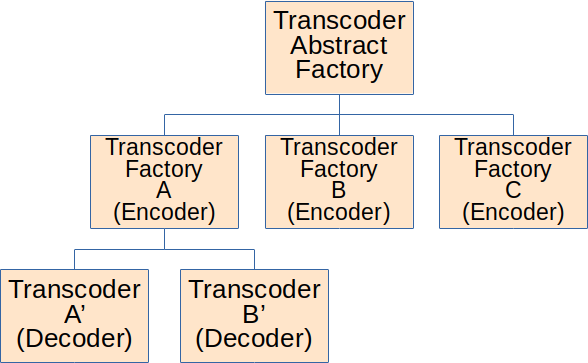

# Table of Contents
1. [Overview](#overview)
2. [Design](#design)
    1. [Transcoder Abstract Factory](#transcoder-abstract-factory)
    2. [Transcoder Factory](#transcoder-factory)
    3. [Transcoder](#transcoder)
3. [Getting Started](#getting-started)
    1. [Initialization](#initialization)
    2. [Acquiring Transcoder](#acquiring-transcoder)
    3. [Transcoding Schemas](#transcoding-schemas)
4. [Creating New Transcoders](#creating-new-transcoders)
5. [Adding Script Source](#adding-script-source)

# Overview

C-based Schema Language Transcoder (cslt) is designed to allow a 
developer to transcode any schema to another schema via C. 
Currently the cslt library *only* support transcoding from legacy
iControl rules to new Gears (sheens) based schema. However, the
library is designed to easily add support for many different 
schemas.

# Design



## Transcoder Abstract Factory

The *Transcoder Abstract Factory* provides *transcoder factories* 
based upon a desired schema encode (output) type. Once a
transcoder factory is acquired then concrete transcoders
may be acquired.

To acquire a transcoder factory from an abstract factory:  

```c
const cslt_factory_t* cslt_get_transcode_factory(const char* encoder);
```

The ``encoder`` specifies which schema is desired after
all transcoding has been accomplished.

If an appropriate transcoder factory is located then it will
be returned to the caller.

## Transcoder Factory

A *transcoder factory* allows access to a single schema
encoder (the output schema) and potentially many different 
decoders (the input schema). By allowing access to a 
transcoder factory the library allows a caller to know
what type of schema that want as the final result, but 
the caller doesn't need to know the input schema.

To acquire a concrete transcoder from the factory:

```c
const cslt_transcoder_t* cslt_get_transcoder(const cslt_factory_t* factory,
                                             const char* schema);
```

The ``const cslt_factory_t* factory`` is the transcoder factory and 
``schema`` is the schema to be decoded (input).

If an appropriate concrete transcoder is located then it will be
returned to the caller.

## Transcoder

A *transcoder* is a concrete converter of schema A'
to schema A. A transcoder contains only two basic 
routines:  

```c
bool is_valid(const char* schema);
int transcode(const char* src, char** dst, size_t size);
```

``is_valid`` allows a caller to determine if this transcoder 
supports the provided schema type.

``transcode`` performs the actual transcoding from ``src``, or
schema A', to ``dst``, or schema A. The ``*dst`` may be ``NULL``
in which case a new buffer will be created for the caller, and
it is the callers responsibility to release the new buffer. If
the decoder (input) and encoder (output) are the same then
``*dst`` will be assigned to the value of ``src``. This allows
for instances of zero copy.
If ``*dst`` is a valid pointer then ``size`` must be specified, and
represent how much memory is available. If more information
will be written than the buffer allows then the default error
of ``-1`` will be returned with ``errno`` set to ``E2BIG``.

# Getting Started

## Initialization

```c
void cslt_init(icHashMap* transcoder_settings);
```

Within  the ``cslt`` there may be many different transcoders 
that supply both encode and decode. Each of these transcoders
may have special initialization parameters that need to
be set up. The special ``transcoder_settings`` provides a 
*hash map* of *hash maps*. The *key* to the transcoder 
settings is the registered name of the codec. An example
would be ``TRANSCODER_NAME_SHEENS``. The *value* provided
back by the hash map is a second-level hash map containing
key/value pairs of all the settings. An example would be
the key ``SHEENS_TRANSCODER_SETTING_ACTION_LIST_DIR`` with
the value ``/opt/icontrol/etc/rules``.

Once initialization is finished the settings may be 
released.

## Acquiring Transcoder

There are two core paths to acquiring a transcoder:  
1. Through the abstract factory and transcoder factory
2. Directly by concrete transcoder specification.

In order to acquire through the abstract factory and
transcoder factory the following routines should be
used.

```c
const cslt_factory_t* cslt_get_transcode_factory(const char* encoder);
const cslt_transcoder_t* cslt_get_transcoder(const cslt_factory_t* factory,
                                             const char* schema);
```

An example would be:  
```c
const cslt_factory_t* factory;
const cslt_transcoder_t* transcoder;

// Obtain the Sheens based schema factory
factory = cslt_get_transcode_factory(TRANSCODER_NAME_SHEENS);

// Obtain the concrete transcoder based on a
// provided schema
transcoder = cslt_get_transcoder(factory, "<legacy rules XML>");
```

The example first acquires a factory that will provide for
transcoding directly to the Sheens based schema. It is 
important to say again, all output from **any** concrete 
transcoder will be in the Sheens schema. The example then
obtains a concrete transcoder that will decode legacy
iControl rules XML schema into the Sheens schema. The
factory may be called to obtain a new transcoder based
on a different decode (input) schema at any time. The
factory may even provide a concrete transcoder that
performs a simple pass-through with zero-copy.

Next, we can obtain a concrete transcoder by providing
both the decoder (input) and encoder (output) names.

```c
const cslt_transcoder_t* cslt_get_transcoder_by_name(const char* decoder,
                                                     const char* encoder);
```

An example would be:  
```c
const cslt_transcoder_t* transcoder;

transcoder = cslt_get_transcoder_by_name(TRANSCODER_NAME_ICRULE, TRANSCODER_NAME_SHEENS);
```

The example directly specifies that it wants a transcoder
with the decoder (input) schema to be of type legacy iControl
rules and the encoder (output) schema to be of the type Sheens.

The transcoder does not need to be released in any way
as the originally provided transcoder is marked as 
constant and is immutable.

## Transcoding Schemas

A schema may be transcoded either by a concrete transcoder,
or through on of the many helper routines.

```c
int cslt_transcode(const cslt_transcoder_t* transcoder,
                   const char* src,
                   char** dst);

int cslt_transcode_preallocated(const cslt_transcoder_t* transcoder,
                                const char* src,
                                char* dst,
                                size_t size);

int cslt_transcode_by_name(const char* decoder,
                           const char* encoder,
                           const char* src,
                           char** dst);

int cslt_transcode_by_name_preallocated(const char* decoder,
                                        const char* encoder,
                                        const char* src,
                                        char* dst,
                                        size_t size);

int cslt_transcode_by_schema(const char* encoder,
                             const char* src,
                             char** dst);

int cslt_transcode_by_schema_preallocated(const char* encoder,
                                          const char* src,
                                          char* dst,
                                          size_t size);
```

Any routine that has the name ``preallocated`` must be passed
a valid memory buffer of at least ``size`` bytes large for
the newly transcoded schema to be written into. If the
newly encoded schema is too large to fit into the 
pre-allocated memory buffer then an error of type
``E2BIG`` will be returned within the ``errno`` variable.

All other transcoding routines will create a new buffer for
the caller.

Any call to transcode is thread safe, and a concrete 
transcoder may be called multiple times.

# Creating New Transcoders

New concrete transcoders may easily be created within the library 
by providing the implementation to a simple interface.

```c
/** An individual transcoder that describes what
 * it can decode from and encode to.
 */
typedef struct cslt_transcoder {
    /** The supported decoder for this transcoder. */
    const char* decoder;

    /** The supported encoder for this transcoder. */
    const char* encoder;

    /** Verify that this transcoder can support the
     * supplied schema.
     *
     * @param schema The schema to be transcoded.
     * (Example: iControl legacy Rules)
     * @return True if the schema is supported by this
     * transcoder, otherwise false.
     */
    bool (*is_valid) (const char* schema);

    /** Transcode the supplied source schema to a
     * new schema.
     *
     * @param src The source schema that will be decoded.
     * @param dst The destination buffer for the new encoded
     * schema. If the dst points to a NULL pointer then a
     * new buffer will be created by the transcoder and supplied
     * back to the caller. If the dst points to a non-NULL pointer
     * and size is greater than zero then supplied buffer will be
     * used up to the provided size.
     * @param size The number of bytes available to write into the
     * dst pointed memory. If dst points to NULL then this parameter
     * is ignored.
     * @return The total number of bytes written. If dst point to
     * a NULL pointer, and src points to a passthru schema then
     * the returned value may be zero. On error -1 will be returned
     * and errno will be filled in.
     * EINVAL: An invalid parameter was supplied.
     * ENOMEM: Memory failed to allocate internally.
     * EBADMSG: The supplied schmea contained an error that caused
     * the transcoder to fail.
     * E2BIG: The final encoded schema was to big for the supplied
     * dst memory with the provided size. This error may only
     * occur when both a valid dst memory address and a size greater
     * than zero is provided.
     */
    int (*transcode) (const char* src, char** dst, size_t size);
} cslt_transcoder_t;
```

All transcoders must be concrete in both the supported
schema decoder (input) and schema encoder (output). Thus
at implementation time the decoder and encoder *must be*
known.

The ``is_valid`` routine will be called by the factory to
determine if this transcoder can produce the decode a 
valid schema. If the transcoder cannot support
the decoder then it *must* return *false*.

The transcode must supply a valid implementation of the
``transcode`` routine. The ``src`` must be of type
*decoder* schema and produce *encoder* schema within the
``*dst`` memory buffer. If ``*dst`` is ``NULL`` then
a new memory buffer will be created for the caller, and
it is the callers responsibility to release said 
memory. If ``*dst`` is not ``NULL`` then a valid
memory buffer of size ``size`` must be provided. 
If the encoder produces more data than may be stored
within ``*dst`` the routine *must* set ``errno`` to
``E2BIG`` and return the standard value of ``-1``.

# Adding Script Source

Sheens transcoder needs to inject javascript source into the final
specification. Rather than write the javascript out as a long c string,
one can put it all int a javascript source file location in
./src/sheens/js. At build time, the stringifyFiles.sh script will
convert any javascript files in that directory into header files
containing the macros for the javascript block. Use plain ECMA5 script whenever
possible. You may inject a valid macro with a native substitution magic word: `{{identifier}}`