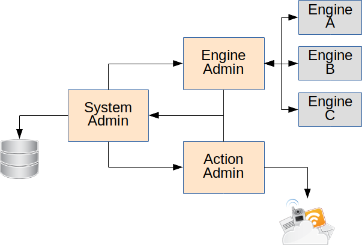
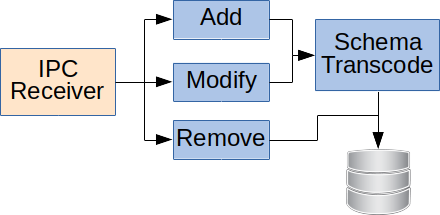
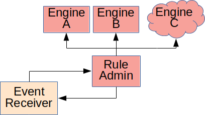
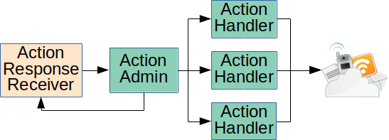

# Table of Contents

1. [Overview](#overview)
2. [Design](#design)
    1. [System Administration](#system-administration)
    2. [Rules Engine Administration](#rules-engine-administration)
    3. [Action Administration](#action-administration)

# Overview

The *automation service* is the driving force behind
all a "automations" in the system. An automation is defined
as any action, or sequence of actions, based upon a
stimulus, or stimuli, from an internal or external source.

Thus the automation service is *not* a rules engine
in of itself. Rather, it is command coordinator of
stimuli into a "rules" engine, and handler of the
action sequences. It is important to note that
the rules engine need not be local to the device
the automation service is running on.  

# Design

The automation service is blocked into three core components: 
system administration, rules engine administration, 
and action administration. System administration handles
the direct I/O of stimuli input and rules storage. The
rules engine administration handles stimuli input into
the rules engine and reporting the engine output. The
action administration handles communicating the 
"physical" action with the device(s).



## System Administration

The system administrator is responsible for handling the 
addition, deletion, and other basic management of
concrete "rules" placed into the system. This may,
but is not limited to, interacting with system storage,
external storage, or network based systems. The 
system administrator also handles all coordination
between internal/external stimuli (ex. internal events,
IPC messages, etc) and the rules administrator. When a rules
engine is finished processing a stimuli into a desired
action it is the system administrators responsibility to
coordinate that request with the action administrator.

### Rule Management Block Diagram



### Rule Engine Block Diagram

 

### Action Block Diagram



## Rules Engine Administration

> Note: This section of the document will attempt to describe the
> architecture as *desired*, which may slightly different than
> currently implemented. Any discrepancies will be described as a
> note to that section.

The rules engine administrator coordinates incoming stimuli
with a (or multiple) rules engine to determine if any actions
need to be performed. A *rules engine* is any set of 
algorithms that evaluate a stimulus against a set of 
constraints to determine if, and when, a specific action
should occur. A rules engine may have it's own schema
to evaluate the stimulus against.

If a rules engine determines that an action is necessary then
the engine *must* event out an action response. The response
describes what action is to be performed, and provides all
information to realize the action.

### Stimuli

> Note: The current Rules Administrator only accepts
> iControl styled JSON "events". Thus events are not
> "defined" other than by iControl events themselves.
> This limits the functionality to a local rules engine
> as it is not desirable to broadcast a local event
> style out to the world. A fully realized
> implementation should *only* allow a standardized
> JSON format that abstracts all stimuli into a 
> pre-determined style. 

All stimuli must be in the standard
[JSON](https://tools.ietf.org/html/rfc7159) format.

The following JSON entries are *required* on every 
stimuli:  

```json
{
  "_evId": <number>,
  "_evCode": <number>,
  "_evTime": <number>,
  "_sunrise": <number>,
  "_sunset": <number>
}
```

``_evTime``, ``_sunrise``, and ``_sunset`` are all standard "seconds
since Epoch".

``_evId`` is an unsigned 64-bit value that is unique in "space", but
not "time". Thusan ``_evId`` may be relied upon within a single device
while the device is actively operating, but will not survive
power cycles.

All other JSON entries in the stimuli are specific to an
individual stimuli and thus are not *currently* definitively
defined. Each individual rule will need to evaluate the 
stimulus in order to determine if it contains all required
information for itself.

### Supported Engines

> Note: Currently there is only one supported rules engine,
> and it is built directly into the administrator. This
> may change in the future as we support more rules
> engines, or start mixing local and remote engines.

#### Gears (a.k.a Sheens)

The *Gears* (a.k.a Sheens) engine is the current Comcast "cloud" based
rules engine. In order to operate on an embedded system the creators
of Gears provided new version of the engine named *littlesheens*.

From this point forward this document will reference the Gears engine
as Sheens. This is due to the fact that Gears may refer to more
than just the rule evaluation portion.

It is important to read, and understand, the
[Sheens](https://github.com/Comcast/sheens)
main documentation. This document will only lightly review Sheens
structure.

Sheens is a *state machine* styled rules engine with individual states
being allowed to execute an arbitrary interpreted language.

> Note: The currently supported interpreter is JavaScript. 
> For *littlesheens* the interpreter is ``duktape``.

Sheens is formed around two types of "containers": a *crew*
and a *machine*. A *crew* may contain `n` number of *machines*.
A *machine* is a schema contains `n` number of states that
may be transitioned through based on a stimulus.

Every machine state will receive, and return back, a JavaScript object
named ``_.bindings`` where the ``_`` represents the master "object".
The bindings will be unique to an individual machine.
 
Each machine state operates either as a *message* type,
or an *interpreted* type.

A message type may only evaluate
an incoming stimuli, form *bindings*, and branch to one
target. A message type may not evaluate bindings, and may not
execute interpreted entries. Any evalution "key" may contain two
forms of *variables*: ``"key": "?<string>"`` and ``"key": "??<string>"``. 
The ``?`` variable informs the evaluator that the ``key`` *must*
be present and that any value *must* be accepted. A new entry within 
``_.bindings`` will be created with the key ``?<string>``.
The ``??`` variable informs the evaluator that a ``key`` *may* be
present and that any value *must* be accepted. If the ``key`` *is* 
present then a new entry within ``_.bindings`` will be created with the
key ``??<string>``.

All other state types are considered *interpreted* and will be 
described in greater detail within the Sheens documentation. This
document will provide only the most important information to the
automation service use.

An interpreter may directly evaluate, and manipulate, the
``_.bindings`` and it may configure an ``_.out`` function
providing a JSON (array of) object(s).

> Note: More detail on the automation service use of ``_.out``
> information will be covered within the actions section.

Every state that contains interpreted code *must* return a
new JavaScript object that will replace the ``_.bindings`` 
object. The returned object may be the ``_.bindings`` object
itself. Machines will **not** operate properly if an ``_.bindings``
fails to be returned.

Any state that contains interpreted code *may* call the 
special ``_.out(json)`` routine. The JSON may be an 
array of objects, or a single object. The JSON data
will be provided back to the automation service which
will use the information as an *action*.

Within the ``_.binidngs`` the automation service has defined
an entry ``persist``. Anything placed within this entry
will be preserved across evaluations. It is important to note
that this is *automation service* defined and not inherent to
Sheens.

### Design

> Note: This section of the document will describe exactly as
> the code *is today*. This is different than above which
> described what we *wanted*. This discrepancy is due to
> the fact we want to provide explicit methods to 
> use the service.

#### Bringing Rules Online

```c
bool automationCrewInit(automationCrewEmitHandler emitHandler,
                        automationGetSheensSpec specGetter);
```

To bring the rules administrator online it must be initialized
with a callback routine to handle any action-able output
from the rule engine, and separate callback routine to provide
Sheens specifications from the system administrator.
 

```c
typedef void (*automationCrewEmitHandler)(const char* id,
                                          uint32_t consumed,
                                          cJSON* emitted);
```

The action-able output callback routine will provide the
*machine* ID, how many messages were consumed by this machine,
and all action-able output for this machine. The action-able
output JSON may be either an array of JSON objects, or
a single JSON object. Thus care *must* be taken to test
the JSON output to determine the type.

```c
typedef const char* (*automationGetSheensSpec)(const char* specName,
                                               const char* cached);
```

The Sheens specification callback provides the individual
machines to the rules engine. The callback will be provided
the name of the specification to load (will always be
the rule ID number) and the currently cached specification. 
If the cached version is NULL, or not equal to the current 
specification in storage then a new copy of the specification
*must* be returned. Otherwise the cached version may be returned
as is.

Once the rules administrator is initialized all resources
will be allocated, however any internal threads of operation
will *not* be started until explicitly told to.

```c
void automationCrewStart(void);
```

When the rules administrator is started all necessary threads
of operation will be started (which is currently one thread), and
the internal queues will be waiting for new stimuli.

#### Machine Management

The system administrator handles storage of all rules, however,
the rules engine still needs to know which rules are currently
enabled so that the engine process only those which are 
enabled.

```c
bool automationCrewAddMachine(const char* id);
void automationCrewRemoveMachine(const char* id);
```

Whenever a rule is enabled (either at load time, or later)
the rule *must* be "added" by ID into the administrator.
Vise-versa, the rule *must* be removed by ID from the 
administrator when the rule is disabled.

#### Handling Stimuli

```c
bool automationCrewPost(char* message);
```

All stimuli must be "posted" into the rules administrator. 
The administrator will *own* the stimuli after it has
been posted thus the caller *must* not attempt to
free the allocated memory. The message will be placed into
an internal queue which will be processed (in order) by the
main administrator thread.

#### Handling Actions

All actions will be sent to the callback described in
[Bringing Rules Online](#bringing-rules-online) by the
action-able output callback routine.

#### Bringing Rules Offline

```c
void automationCrewDestroy(void);
``` 

Destroying the rules administrator will stop all internal 
resources, and then release those resource back to the system.
Any interaction after destroying the administrator (and
before bringing the administrator back online) will be
undefined.

## Action Administration

> Note: This section of the document will describe exactly as
> the code *is today*. This is different than above which
> described what we *wanted*. This discrepancy is due to
> the fact we want to provide explicit methods to 
> use the service.

The action administrator is responsible for handling
all action-able requests determined to be valid
by the rules administrator. The actions may vary from
sending notifications, changing device behavior, 
changing system state, and even sending information
to an external resource.

### Design

The action administrator does not inherently "know"
what types of actions may be needed now, or in 
the future. Thus the design must take into account
that new actions will be created as needed, and that
information required per-action may be different.
In order to facilitate this requirement a new action
must *register* itself with the action administrator,
and be able to accept a JSON object with a few 
required fields.

Every action that is utilized by a handler an
appropriate *response* must be generated.

The action administrator will allow each rule in the system to
handle its own actions independently from all other rules.
Instead of having an individual thread for each rule a thread
pool is utilized such that if a rule not currently processing
an action then a new thread will be obtained. If, however, the
rule is already processing an action then the new action will
be placed within that rule's internal list and processed on
the currently obtained thread. Once the rule has processed all
actions the obtained thread will be released back to the pool.

#### Bringing Actions Online

```c
bool automationEmitInit(automationEmitResponseHandler callback);
```

To bring the action administrator online it *must* be
intialized with a valid response callback routine handler.
The response callback handler will receive an appropriate
response JSON from the action handler that dealt with
an action.

```c
typedef void (*automationEmitResponseHandler)(const char* targetName, const cJSON* json);
```

The response callback handler will receive the name of the action
handler, as well as, the JSON object containing the actual
response.

#### Machine Management

The system administrator handles storage of all rules, however,
the action administrator still wants to know which rules
are enabled so that the administrator may allow each rule
to handle actions independently of each other.

```c
bool automationEmitAddMachine(const char* id);
void automationEmitRemoveMachine(const char* id);
```

Whenever a rule is enabled (either at load time, or later)
the rule *must* be "added" by ID into the administrator.
Vise-versa, the rule *must* be removed by ID from the
administrator when the rule is disabled.

#### Handling Actions

```c
bool automationEmitPost(const char* id, cJSON* emitted);
```

All actions to be processed *must* be "posted" into the action
administrator.

The `id` represents the rule that the action was generated from.

The action JSON is passed through `emitted`, and will be *owned*
by the action administrator moving forward. The caller *must
not* release any memory associated with the action JSON.

#### Action JSON

```json
{
  "to": <string>
  "requestType": <string>
}
```

The ``to`` field informs the action administrator which
action handler to send the action JSON to. This allows
an arbitrary number of action handlers to be generated
in the future.

The ``requestType`` field is required for every action
handler, however, its value is determined by the
action handler itself. Thus different action handlers
may require different values at this time.

Every action handler may have more JSON entries in
order to fully realize an action. You may find
individual action handlers in their respective
[documentation](core/src/messageTargets/ActionDescriptions.md).

#### Response JSON

```json
{
    "success": <bool>
    "type": <string>
}
```

The `success` field provides a boolean value that describes if
the action was successfully handled.

The `type` field is always the `requestType` with the string
"Response" appended on the end. (ex. `writeResourceResponse`)

Every action handler may have more JSON entries in the response
JSON in order to fully describe the action. You may find
individual action handler responses in their respective
[documentation](core/src/messageTargets/ActionDescriptions.md).

### Add New Action Handler

```c
/**
 * Emit message handling operations object structure definition.
 *
 * Emit messages are targeted commands to perform
 * specific actions. In order to best handle the wide
 * variety of actions that <em>could</em> exist the emit
 * message sub-system requires a set of operations to be
 * defined.
 *
 * Some examples might be:
 * <ul>Inform a Zigbee device to perform an action</ul>
 * <ul>Set a timer to fire at some point in time.</ul>
 * <ul>Communicate directly through IPC to another service. </ul>
 */
typedef struct _automationEmitOps {
    /** Unique name representing this emit target. */
    const char* name;

    /**
     * Handle a new emit message, and submit any response
     * required. The response will be owned by the receiver
     * at the time of the request return.
     *
     * @param id The request callers ID.
     * @param request The JSON emit message.
     * @return The JSON response, or NULL if no response required.
     * The receiver owns the JSON object at time of return.
     */
    cJSON* (*request)(const char* id, const cJSON* request);

    /**
     * Provide a the response handler that may be called for
     * any emit target handler that requires submitting response
     * asynchronously.
     *
     * The target handler is responsible for the any JSON
     * that is passed into the response handler.
     *
     * Note: This operation is optional.
     *
     * @param handler The response handler function pointer.
     */
    void (*setResponseHandler)(automationEmitResponseHandler handler);
} automationEmitOps;
```

Every action handler has a set of "operations" that must be defined.

The `name` field must be unique across all action handlers. The
name will be used within the `to` field of the action JSON in order
to identify this action handler is desired.

The `request` function pointer *must* be defined by the action
handler. The request will be notified of the rule ID and will
be provided with the actual action JSON. An action response JSON
*may* be provided back if one is required.

The `setResponseHandler` *may* be defined by the action handler.
The response handler function pointer allows for a target handler
to asynchronously notify when an action is finished being processed.

#### Registering Action Handlers

```c
void automationEmitRegisterOps(const automationEmitOps* ops);
```

Every action handler *must* be registered with the action
administrator before it may be utilized. A core set of action
handlers will be registered automatically during the action
administrator bring up. However, a caller may register new
action handlers at any time after initialization of the action
administrator.
