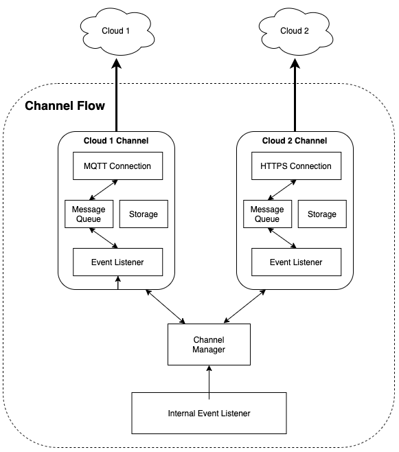

# Comm Service Architecture

This document is intended to define and illustrate the overall CPE communication
logic with various Servers.   Regardless of the platform, all communication is 
encapsulated into a single service, Comm Service. The purpose of this service 
is to establish a communication link with one or more servers to send up event 
messages, receive requests, and query for information. 

* Support multiple and simultaneous "channels"
* Channels are enabled/disabled at runtime based on configuration
* Channels should support asynchronous or synchronous communication
* Each channel is responsible for its own:
  * activation
  * message queueing
  * marshalling/unmarshalling of data
  * configuration storage (if applicable)

